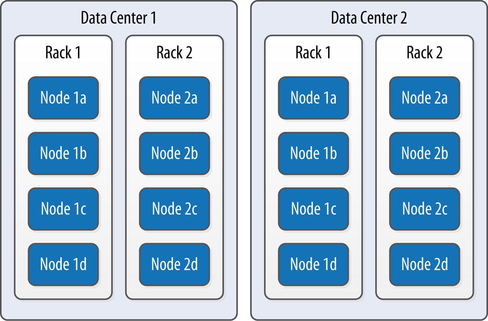

# Cassandra

## Overview

* High performance at significant `write` volumes with many `concurrent client threads` is one of the primary features of Cassandra.
* Cassandra has out-of-the-box support for `geographical distribution` of data. You can easily configure Cassandra to `replicate data across multiple data centers`.
* The design of the `primary key` is extremely important, as it will determine how much data will be stored in each partition and how that data is organized on disk, which in turn will affect how quickly Cassandra processes read queries.

<p float="left">
    
    
</p>

* A `higher consistency level` means that `more nodes` need to respond to a read or write query, giving you more assurance that the values present on each replica are the same.
* `QUORUM` consistency level requires a response from a majority of the replica nodes: `Q = floor(RF/2 + 1)`. `RF` is a replication factor. To achieve `strong consistency`: `R + W > RF`, where `R` is the read replica count, and `W` is the write replica count.
* The `replication factor` is set per keyspace. The `consistency level` is specified per query, by the client. The `replication factor` indicates how many nodes you want to use to store a value during each write operation. The `consistency level` specifies how many nodes the client has decided must respond.
* Streaming is Cassandra’s optimized way of sending `SSTable` files from one node to another via a `persistent TCP connection`.

<p float="left">
    
</p>

* Cassandra provides two mechanisms that you can use as alternatives to managing multiple denormalized tables: `secondary indexes` and `materialized views`.
* Cassandra partitions data across multiple nodes, so each node must maintain its own copy of a `secondary index` based on the data stored in partitions it owns. For this reason, queries involving a secondary index typically `involve more nodes`, making them significantly more expensive.
* For columns that are `frequently updated or deleted`, indexes built on these columns can generate errors if the amount of deleted data (`tombstones`) builds up more quickly than the `compaction process` can handle.
* For optimal read performance, `denormalized table` designs or `materialized views` are generally preferred to using secondary indexes.
* Instead of the `application` having to `keep multiple denormalized tables in sync`, Cassandra takes on the responsibility of updating views in order to keep them consistent with the base table, and `aterialized view` updates are implemented using `batching`.

* Companies that use both `microservice` architectures and Cassandra at large scale, such as Netflix, are known to use `dedicated clusters per service`.
* Using a `distributed analytics tool` such as Apache Spark to check data for `consistency` as a background processing task.
* A variant of the `event-based choreography` approach is to leverage the `change data capture (CDC)` feature of a database as the source of events, rather than relying on a service to reliably persist data to a database and then post an event.

<p float="left">
    
</p>

## Example

Q1. Find hotels near a given point of interest.

Q2. Find information about a given hotel, such as its name and location.

Q3. Find points of interest near a given hotel.

Q4. Find an available room in a given date range.

Q5. Find the rate and amenities for a room.

<p float="left">
    
</p>

```sql
CREATE KEYSPACE hotel
    WITH replication = {'class': 'SimpleStrategy', 'replication_factor' : 3};

CREATE TYPE hotel.address (
    street text,
    city text,
    state_or_province text,
    postal_code text,
    country text
);

CREATE TABLE hotel.hotels_by_poi (
    poi_name text,
    poi_description text STATIC,
    hotel_id text,
    name text,
    phone text,
    address frozen<address>,
    PRIMARY KEY ((poi_name), hotel_id)
) WITH comment = 'Q1. Find hotels near given poi'
AND CLUSTERING ORDER BY (hotel_id ASC);
```

Q6. Look up a reservation by confirmation number.

Q7. Look up a reservation by hotel, date, and guest name.

Q8. Look up all reservations by guest name.

Q9. View guest details.

<p float="left">
    
</p>

## CQL

Create and insert into the table `users`:
```sql
CREATE TABLE users (first_name TEXT, last_name TEXT, title TEXT, PRIMARY KEY(first_name, last_name));

INSERT INTO users (first_name, last_name, title) VALUES ('hughie', 'campbell', 'vgilante') USING TTL 60;

INSERT INTO users (first_name, last_name, title) VALUES ('billy', 'butcher', 'cia');
UPDATE users USING TTL 120 SET title='leader' WHERE first_name='billy' AND last_name='butcher';

SELECT first_name, last_name, title, ttl(title), writetime(title), token(first_name) FROM users;

 first_name | last_name | title    | ttl(title) | writetime(title) | system.token(first_name)
------------+-----------+----------+------------+------------------+--------------------------
      billy |   butcher |   leader |         16 | 1657365893643148 |     -6348507905261101368
     hughie |  campbell | vgilante |         55 | 1657365812873743 |     -1111051912190428605

 first_name | last_name | title    | ttl(title) | writetime(title) | system.token(first_name)
------------+-----------+----------+------------+------------------+--------------------------
      billy |   butcher |     null |       null |             null |     -6348507905261101368
     hughie |  campbell | vgilante |         10 | 1657365812873743 |     -1111051912190428605
     
first_name | last_name | title | ttl(title) | writetime(title) | system.token(first_name)
------------+-----------+-------+------------+------------------+--------------------------
      billy |   butcher |  null |       null |             null |     -6348507905261101368
```

Insert into the table `users` with `JSON` data:
```sql
INSERT INTO users JSON '{"first_name": "mother", "last_name": "milk"}' ;

SELECT JSON * FROM users;

 [json]
--------------------------------------------------------------------
 {"first_name": "billy", "last_name": "butcher", "title": "leader"}
    {"first_name": "billy", "last_name": "what", "title": "leader"}
       {"first_name": "mother", "last_name": "milk", "title": null}
```

Create the secondary index on the column `title`:
```sql
CREATE INDEX ON users (title);

SELECT * FROM users WHERE title='leader';

 first_name | last_name | title
------------+-----------+--------
      billy |   butcher | leader
      billy |      what | leader
      
DROP INDEX users_title_idx;
```

Create the materialized view on the base table `users`:
```sql
CREATE MATERIALIZED VIEW users_by_title 
AS SELECT first_name, last_name, title FROM users
WHERE first_name IS NOT NULL and last_name IS NOT NULL and title IS NOT NULL
PRIMARY KEY (title, first_name, last_name);

SELECT * FROM users_by_title WHERE title='leader';

 title  | first_name | last_name
--------+------------+-----------
 leader |      billy |   butcher
 leader |      billy |      what
```

## References

* https://github.com/apache/cassandra#getting-started
* https://db-engines.com/en/ranking
* https://db-engines.com/en/ranking/wide+column+store
* https://hostingdata.co.uk/nosql-database/
* https://hackolade.com/nosqldb.html#cassandra
* https://downloads.datastax.com/#devcenter
* https://cassandra.apache.org/doc/latest/cassandra/cql/index.html
* https://murukeshm.github.io/cassandra/trunk/tools/cassandra_stress.html
* https://kubernetes.io/docs/tutorials/stateful-application/cassandra/
* https://medium.com/@27.rahul.k/cassandra-ttl-intricacies-and-usage-by-examples-d54248f2853c
* https://issues.apache.org/jira/browse/CASSANDRA-9778
* https://issues.apache.org/jira/browse/CASSANDRA-8099
* https://issues.apache.org/jira/browse/CASSANDRA-13474
* https://datacater.io/blog/2021-09-02/postgresql-cdc-complete-guide.html